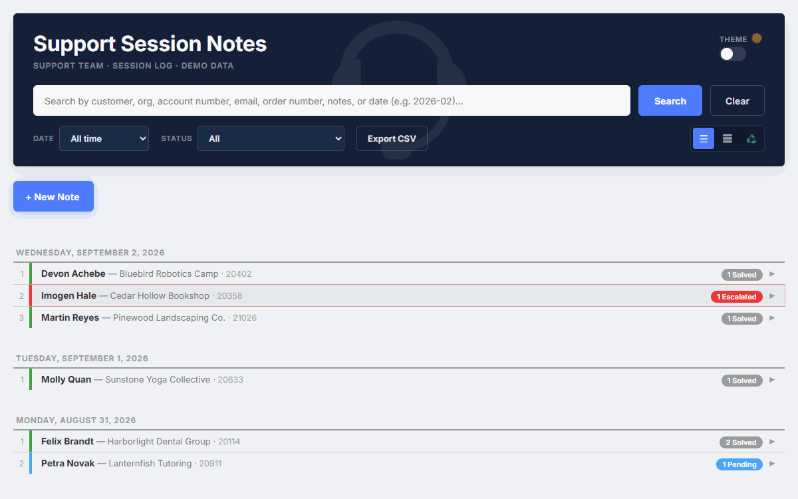
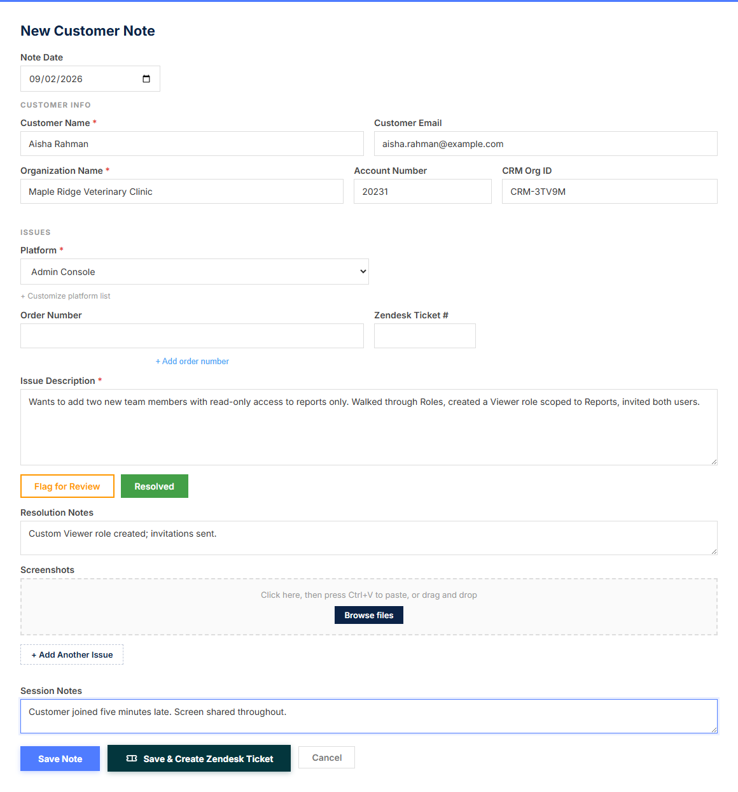
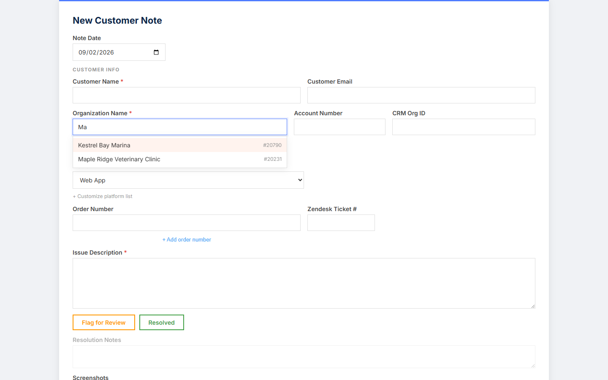
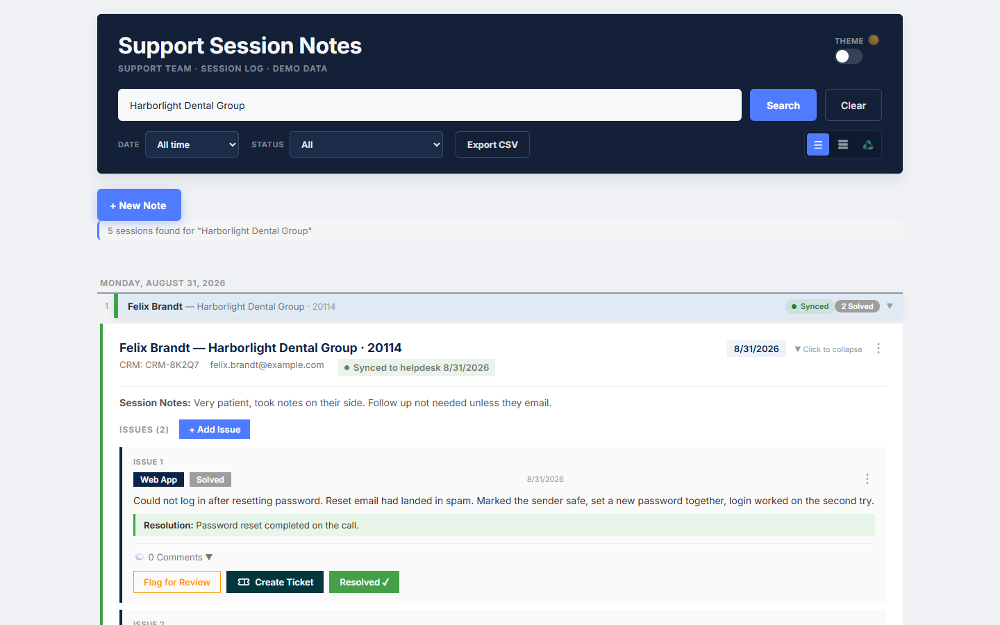

# Support Session Notes

An internal tool for support agents to take structured notes during live customer calls, look up who they are talking to, and sync every note to the helpdesk.



| Notes editor during a session | Organization and contact lookup |
| --- | --- |
|  |  |

| Session history with helpdesk sync status |
| --- |
|  |

The GIF is a scripted walkthrough recorded by [scripts/demo-gif.js](scripts/demo-gif.js) against the seeded app: one organization's session history, a new note with the contact picked from the directory, an issue logged and resolved, the note syncing to the helpdesk, and the create-ticket dialog.

## What it does

- **Session notes editor.** One note per call. The agent picks the customer, the app fills in their organization, account number and CRM id from the directory, and the agent logs one or more issues: product area, description, order numbers, tags, screenshots (paste or drag in), status, and resolution. Ctrl+S saves. Unsaved changes are protected on navigation.
- **Organization and contact directory.** Typeahead fields search a directory of organizations and their people. Picking a contact fills the rest of the header. Every saved note adds new organizations and contacts to the directory, and a conflicting entry (same account number, different name) comes back as a warning instead of a silent overwrite.
- **Helpdesk sync.** Every save queues a sync that writes the note to a custom object record in the helpdesk (Zendesk), keyed by the note's UUID so re-syncs update rather than duplicate. A nightly reconciliation catches anything that failed, and each note shows Synced, Sync pending, or Sync failed. Agents can also create a helpdesk ticket from one or more issues in two clicks; a poller closes the issue here when the ticket is solved there.
- **Session history.** Every past session, grouped by day, searchable by customer, organization, account number, email, order number, note text, or date. Filter by status or date range, switch between list and card views, export to CSV.
- **Issue tracking.** Issues move through Pending, Flagged for Review, Escalated and Solved. Escalation opens a pre-filled email to the chosen team and records who it went to. Each issue has a comment thread attributed to a team.
- **Also included.** Recycle bin with a 10 day purge, nightly CSV and database backups, a manageable list of product areas, dark mode, and deep links to a single session.

## Why it exists

Support agents at a SaaS company ran live help sessions over video and took notes in Word documents: one file per call, saved to a shared folder, impossible to search, and disconnected from the helpdesk where the rest of the customer's history lived. This app replaced those documents with a structured record: every session is tied to a real organization and contact, every issue has a status, and every note lands on the customer's helpdesk record without the agent doing anything extra.

It was my first internal tool at that company. It ran on the support team's internal network for daily use, and its helpdesk integration was later migrated from API tokens to OAuth when the vendor retired token authentication.

This repository is a public version of that app. All data is fictional and the helpdesk integration runs against a mock adapter by default.

## How it is built

| Layer | Technology |
| --- | --- |
| Frontend | React 19 (Create React App), no router library, CSS variables for theming |
| Backend | Node.js 20+, Express 5, multer for screenshot uploads, helmet and express-rate-limit |
| Database | SQLite via better-sqlite3, WAL mode |
| Directory | Two CSV files (organizations, contacts) read on request and appended on save |
| Tests | Node's built-in test runner against the running API and mock helpdesk |

The API is one Express process ([src/server.js](src/server.js)). It also serves the compiled UI when `build/` exists, so production is a single process on one port.

**Adapter pattern for the integration.** The helpdesk lives under [src/integrations/zendesk](src/integrations/zendesk) as two files with the same interface: `real.js` calls the vendor API with credentials from `.env`, and `mock.js` is an in-memory helpdesk seeded from [fixtures/zendesk.json](src/integrations/fixtures/zendesk.json). The registry in [src/integrations/index.js](src/integrations/index.js) loads one or the other based on `MOCK_INTEGRATIONS`. The sync logic in [src/zendesk-sync.js](src/zendesk-sync.js) (payload shape, per-session serialization, reconciliation checkpoint, ticket polling) only ever talks to the adapter, so it is identical in both modes.

**OAuth flow.** The real adapter authenticates with the OAuth 2.0 client-credentials grant: it posts the client id and secret to the vendor's token endpoint, caches the bearer token in memory until shortly before it expires, and on a 401 invalidates the token and retries once. Rate-limited responses back off exponentially. The client id and secret exist only in `.env`; nothing in the repository can reach the real API without them.

## Integrations

| System | What it does here | Real adapter | Mock adapter |
| --- | --- | --- | --- |
| Zendesk | Upserts one custom-object record per session note; creates tickets from issues; polls linked tickets every 4 hours and closes solved issues; looks up the organization by account number | OAuth client credentials, custom object key and field ids from `.env` | In-memory records and tickets seeded from a fixture, with a short artificial delay so the sync states are visible |

The public version runs against the mock. The real adapter is the code that ran in production, with the subdomain, object key, field ids and credentials moved to environment variables. `GET /api/helpdesk/records` shows what the mock helpdesk currently holds, which is handy for demos.

## Quickstart

Requires Node.js 20 or newer and npm.

```bash
git clone https://github.com/RonRadzai/support-notes-app.git
cd support-notes-app
npm install
npm run seed
npm run dev
```

Open http://localhost:3000. That is it. No `.env` file is needed; the app defaults to the mock helpdesk and creates `data/app.db` plus the directory files from the seed.

What the scripts do:

| Script | Purpose |
| --- | --- |
| `npm run seed` | Delete and rebuild the database and directory files with fictional, deterministic sample data |
| `npm run dev` | Start the API (port 3001) and the React dev server (port 3000) together |
| `npm run server` | API only. Serves the built UI too if `build/` exists |
| `npm run build` | Production build of the frontend into `build/` |
| `npm run test:server` | API smoke tests against the mock helpdesk |
| `npm run screenshots` | Regenerate the README screenshots with a headless browser against a running instance |
| `npm run demo-gif` | Re-record the README demo GIF with a headless browser (pure JavaScript, no ffmpeg) |

### The demo walkthrough

`docs/demo.gif` is about 40 seconds long and follows this path, which also works as a script for a live demo:

1. Type an organization name in the search bar (for example `Maple Ridge`) and press Search to show that organization's history.
2. Expand a session to show its issues, statuses and the helpdesk sync badge.
3. Click **+ New Note**, start typing a customer name, and pick one from the dropdown. The organization, account number and email fill in.
4. Add an issue: choose a product area, type a short description, mark it Resolved with a resolution note.
5. Click **Save Note**. The new session appears at the top with **Helpdesk sync pending**, then flips to **Synced** on the next refresh.
6. Open the session's menu and choose **Create Zendesk Ticket** to show the ticket dialog, or **Sync to helpdesk** to force a sync.

`npm run demo-gif` replays exactly this path with a headless browser and re-encodes the GIF. Re-seed first, since the walkthrough saves a note.

## Configuration

Copy [.env.example](.env.example) to `.env` and fill in only what you need. Every variable has a placeholder and a comment. The important ones:

- `MOCK_INTEGRATIONS` defaults to true. Set it to false to call the real Zendesk API. The integration stays disabled until the subdomain, client id and client secret are all present.
- `ZENDESK_*` holds the OAuth client, the custom object key, the organization field used to match account numbers, and optional ticket custom-field ids.
- `DB_PATH`, `ORGS_CSV_PATH`, `USERS_CSV_PATH`, `SCREENSHOT_DIR`, `BACKUP_DIR` and `RECIPIENTS_PATH` move the data files. They all default to `data/`, which git ignores.
- `PORT` and `ALLOWED_ORIGIN` control the API port and CORS.
- `REACT_APP_MEETING_URL` adds an optional "Join support call" link to the header at build time.

## Project structure

```
src/
  server.js              Express API: sessions, issues, comments, directory, search, backups, helpdesk routes
  database.js            SQLite schema, indexes, default product areas
  zendesk-sync.js        Sync orchestration: payload, per-session queue, reconciliation, ticket polling
  integrations/
    index.js             Picks real or mock adapters
    zendesk/             real.js (OAuth client credentials), mock.js (in-memory helpdesk)
    fixtures/            zendesk.json: fictional organizations, contacts and tickets
  App.js                 Root component: header, search, filters, new-note form, session list
  components/            SessionCard, IssueCard, IssueForm, Lookup, ZendeskModal, SyncBadge, RecycleBin, ...
  config.js              Runtime config context (ticket URL base, mock flag) from GET /api/config
  constants.js, utils.js Shared values, date helpers, keyboard shortcuts
data/                    app.db, orgs.csv, users.csv, screenshots/, backups/ (created by seed and the app, ignored by git)
scripts/
  seed.js                Deterministic sample data
  screenshots.js         Headless-browser screenshots for the README
  demo-gif.js            Scripted walkthrough recorded to docs/demo.gif
test/                    API smoke tests
docs/                    Screenshots and the demo GIF used in this README
```

## License

MIT. See [LICENSE](LICENSE).
